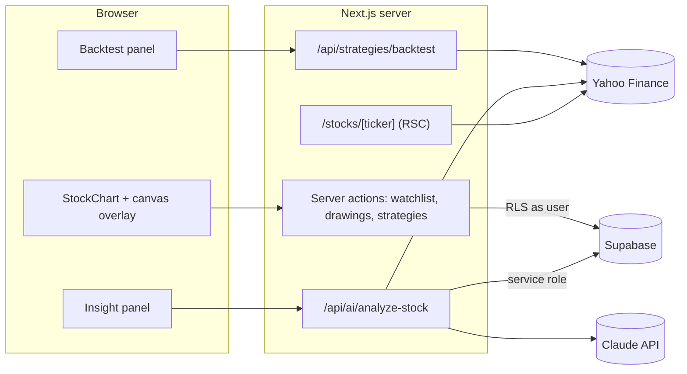

<p align="center"></p>

# MarketIQ

AI-powered stock & financial intelligence: interactive candlestick charts you can
draw on, Claude-generated news sentiment, and an SMA-crossover backtester.

**Stack:** Next.js 15 (App Router) · TypeScript · Tailwind CSS v4 · shadcn/ui ·
Supabase (Postgres, Auth) · TradingView Lightweight Charts v5 · yahoo-finance2 ·
Anthropic SDK (Claude) · Vercel

## Getting started

```bash
cp .env.example .env.local   # Supabase keys, SUPABASE_SERVICE_ROLE_KEY, ANTHROPIC_API_KEY
npm install
npx supabase db push         # applies supabase/migrations/*
npm run dev
```

Requires Node 22+ (yahoo-finance2 v4). Enable email magic links in Supabase and
allow-list `<site>/auth/callback`.

## Features

| | |
| --- | --- |
| **Interactive chart** | Candles, volume and SMA 20/50 toggles. A floating toolbar adds **trendlines** (extended rays), **horizontal levels**, **Fibonacci retracements** and **text notes**, plus an eraser. Drawings are stored in (date, price) space so they stay anchored through zoom and pan, and are saved per user per ticker in `chart_annotations`. |
| **AI insight** | Sentiment, a −1…+1 gauge, impact score, drivers, risks, a strategy idea and cited headlines. See [docs/sentiment-pipeline.md](docs/sentiment-pipeline.md). |
| **Backtesting** | SMA crossover with stop loss / take profit, next-open fills, equity curve, trade log, save to `trading_strategies`. See [docs/backtesting.md](docs/backtesting.md). |
| **Watchlist** | Starred tickers with live quotes, plus your saved strategies. |

## Architecture



The drawing layer is a `<canvas>` stacked above the chart. It converts between
pixels and (date, price) with `timeScale().coordinateToTime()` /
`series.coordinateToPrice()`, and redraws on every visible-range or size change.
While the cursor tool is selected it ignores pointer events, so pan and zoom go
straight to the chart.

## API

| Method | Path | Auth | Purpose |
| --- | --- | --- | --- |
| GET | `/api/market/{ticker}` | — | quote + 2y daily candles (CDN-cached 60 s) |
| GET | `/api/search?q=` | — | symbol search |
| POST | `/api/ai/analyze-stock` | user | `{ ticker, refresh? }` → structured analysis |
| POST | `/api/strategies/backtest` | — | `{ ticker, rules, days? }` → results + equity curve |

## Security

- RLS: users only see and edit their own watchlists, drawings and strategies.
  `ai_insights_cache` is public-read and written only with the service role.
- Tickers are validated (`^[A-Z0-9.\-^=]{1,15}$`) in code and by a DB check constraint.
- Headlines for the AI prompt are fetched server-side, never taken from the client.

## Design system

| Token | Hex |
| --- | --- |
| Primary | `#2563EB` Royal Financial Blue |
| Background | `#FFFFFF` |
| Text | `#0F172A` Slate 900 |
| Card | `#F8FAFC` Slate 50 |
| Positive / Negative | `#10B981` Emerald / `#EF4444` Rose |

Logo: candlesticks and a trendline forming an "M", peaking at a spark node for
the AI ([public/logo.svg](public/logo.svg)).

---

Market data is unofficial and may be delayed. Nothing in this app is financial advice.
