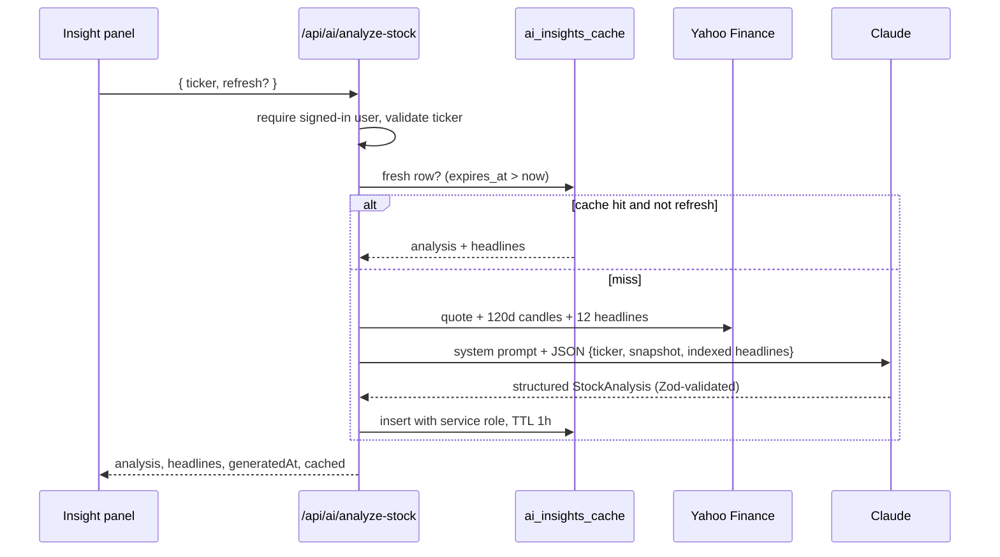

# AI sentiment pipeline

Source: [`src/lib/ai.ts`](../src/lib/ai.ts) · API: `POST /api/ai/analyze-stock`



## Inputs

The server fetches headlines itself. The client only sends a ticker, so a
caller can't inject arbitrary "news" into the prompt. The user message is a
JSON document:

```json
{
  "ticker": "NVDA",
  "company": "NVIDIA Corporation",
  "priceSnapshot": { "lastClose": 0, "date": "", "change60dPct": 0, "high60d": 0, "low60d": 0 },
  "headlines": [{ "index": 0, "title": "", "publisher": "", "link": "", "publishedAt": "" }]
}
```

## Model call

- **SDK:** official `@anthropic-ai/sdk`, `client.beta.messages.parse(...)`.
- **Model:** `claude-opus-5` by default; override with `ANTHROPIC_MODEL`.
- **Structured output:** `output_config.format = betaZodOutputFormat(StockAnalysis)`,
  so the response is parsed and validated against the Zod schema.
- **Prompt caching:** the system prompt is byte-stable and marked
  `cache_control: ephemeral`, so repeat calls across tickers reuse it.
- **Refusal fallback:** `fallbacks: "default"` (beta `server-side-fallback-2026-07-01`).
  If the model declines, the API retries on a fallback model within the same
  call. If the whole chain declines (`stop_reason: "refusal"`), the route returns 422.

## Output schema (`StockAnalysis`)

| Field | Type | Post-processing |
| --- | --- | --- |
| `sentiment` | `BULLISH \| BEARISH \| NEUTRAL` | — |
| `sentimentScore` | number | clamped to [-1, 1], 2 dp; stored in `ai_insights_cache.sentiment_score` |
| `impactScore` | number | clamped to [0, 100], rounded |
| `summary` | string | stored in `summary` |
| `keyDrivers`, `keyRisks` | string[] | max 5 each |
| `recommendedStrategy` | string | educational framing only |
| `citedHeadlines` | int[] | out-of-range indexes dropped; the UI links them as sources |

Numeric bounds are enforced in code rather than in the JSON schema. That keeps
the schema within what structured outputs supports, and the result is still
guaranteed in range.

## Caching & cost controls

- One analysis per ticker per hour is shared by all users (`ai_insights_cache`
  is publicly readable). Only the server writes it, using `SUPABASE_SERVICE_ROLE_KEY`.
- The endpoint requires sign-in. "Refresh" bypasses the cache for that request only.
- Without a service-role key the app still works, just without the shared cache.
